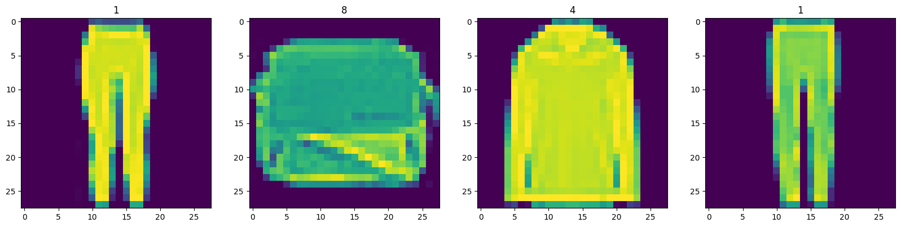
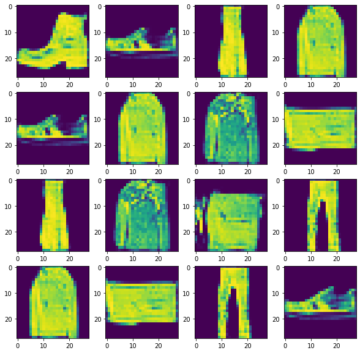

# Overview

This is a sample Generative Adversial Neural Network built upon the dataset of Fashion mnist.

This is a visualisation of the actual MNIST dataset



These are the images that are generated by the GAN network



# Architecture

```
Model: "sequential_5"


dense_5 (Dense) (None, 6272) 809088

leaky_re_lu_10 (LeakyReLU) (None, 6272) 0

reshape_4 (Reshape) (None, 7, 7, 128) 0

up_sampling2d_3 (UpSamplin (None, 14, 14, 128) 0
 g2D)

conv2d_5 (Conv2D) (None, 14, 14, 128) 409728

leaky_re_lu_11 (LeakyReLU) (None, 14, 14, 128) 0

up_sampling2d_4 (UpSamplin (None, 28, 28, 128) 0
 g2D)

conv2d_6 (Conv2D) (None, 28, 28, 128) 262272

leaky_re_lu_12 (LeakyReLU) (None, 28, 28, 128) 0

conv2d_7 (Conv2D) (None, 28, 28, 128) 262272

leaky_re_lu_13 (LeakyReLU) (None, 28, 28, 128) 0

conv2d_8 (Conv2D) (None, 28, 28, 128) 262272

leaky_re_lu_14 (LeakyReLU) (None, 28, 28, 128) 0

conv2d_9 (Conv2D) (None, 28, 28, 1) 2049

=================================================================
Total params: 2007681 (7.66 MB)
Trainable params: 2007681 (7.66 MB)
Non-trainable params: 0 (0.00 Byte)
```
